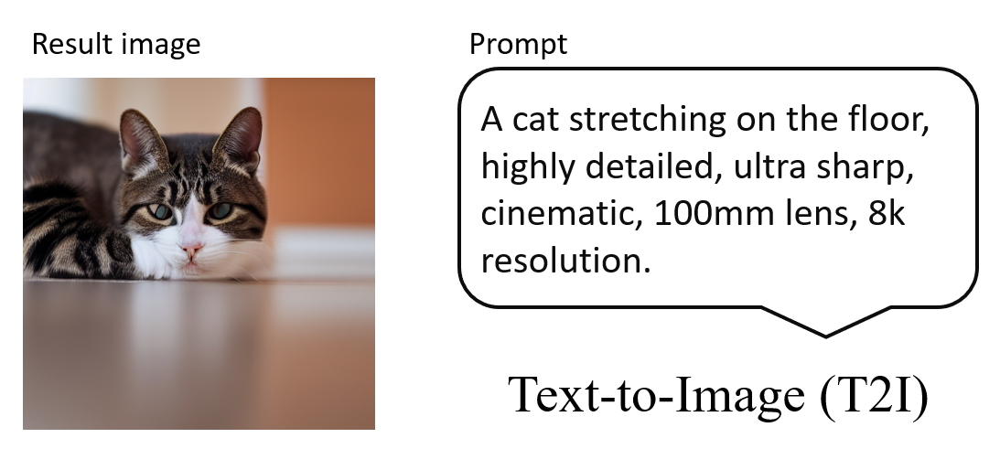
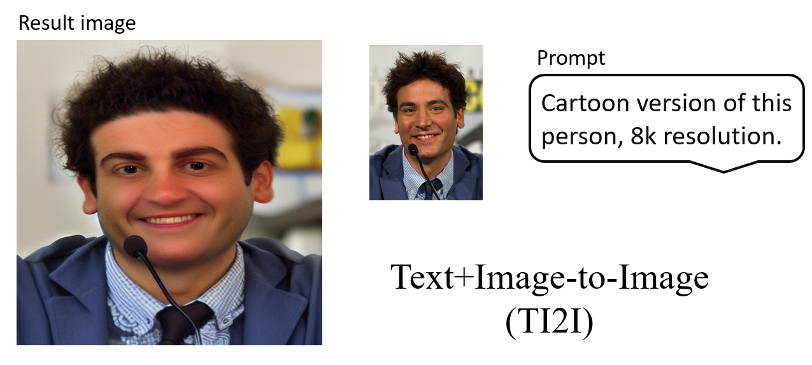

# Diffusion Model for T2I

## Overview

The **Diffusion Model for T2I** (Text-to-Image) utilizes Stable Diffusion techniques to generate high-quality images from textual descriptions. This model transforms abstract text prompts into visually stunning images, making it a valuable tool for artists, designers, and developers alike.

## Features

- **High-Quality Image Generation**: Produces detailed and diverse images based on textual input.
- **Customizable Parameters**: Fine-tune the output with various parameters like CFG scale and inference steps.
- **Image-to-Image Support**: Enhance existing images by incorporating text prompts for creative modifications.
- **Text-to-Image**: Create high-quality image using prompts
## Getting Started

### Prerequisites

Ensure you have the following installed:

- Python 3.9 or higher
- Numpy < 2.0.0
- Pytorch
- Anaconda (recommended for managing dependencies)

### Pretrained Weights

Download this on Hugging Face `stable-diffusion-v1-5/stable-diffusion-v1-5`

### Result

Text-to-Image
<div style="text-align: center;">
    
</div>

Text+Image-to-Image
<div style="text-align: center;">
    
</div>

### Deployed on Streamlit


### Installation

1. Clone the repository:

   ```bash
   git clone https://github.com/JohnnysGithubAccount/Diffusion-Model--for-T2I.git
   cd diffusion-model-t2i
   
2. Run Streamlit
   ```bash
   pip3 install streamlit
   streamlit run main.py

